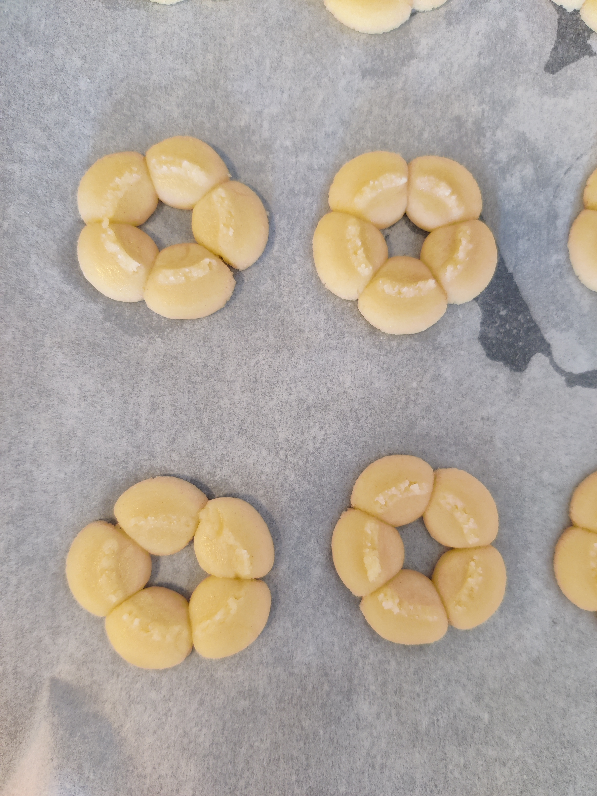

# Småkakor med marmelad

## Ingredienser
- 500 gram smör
- 6 ägg
- 400 gram florsocker
- 2 matskedar vaniljsocker
- 2 matskedar bakpulver
- Vetemjöl efter känsla (se tips nedan)
- Jordgubbsmarmelad (att bre på mellan två kakor)

## Instruktioner
1. Sätt på ugnen på 150-170°
2. Vispa smöret med elvisp och knäck i ett ägg i taget
3. Häll i vaniljsocker och bakpulver sist och vispa
4. Fyll kakpressen med degen
5. Pressa ut önskade former
6. In i ugnen ett par minuter
7. Bre på jordgubbsmarmelad och sätt ihop två kakor medan de är varma

 
<h3>Tips från Lucia och Isa</h3>
När vi gjorde detta recept halverade vi dosen vid ett första försök och hade i följande:
- 250 gram smör
- 3 ägg
- 200 gram florsocker (ca 3,5 dl)
- 9 dl vetemjöl

<strong>Detta blev ca 60 kakor.</strong>

<i>Lucia gör kakorna, här klickas de ut med kakpressen med denna form:</strong>

